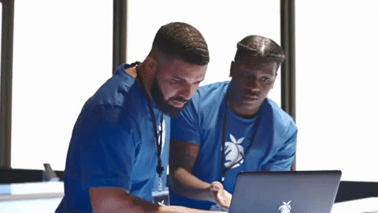

 

i build things, mostly because i get a little too invested in random ideas.

currently somewhere between AI, ML, and backend.

these days, it's either rank push or git push.

 

<!-- LinkedIn -->
<a href="https://www.linkedin.com/in/adithya-p-k/" style="text-decoration:none; display:inline-block;">
<svg xmlns="http://www.w3.org/2000/svg"
     width="28"
     height="28"
     viewBox="0 0 28 28"
     style="vertical-align:middle;">
  <rect width="28" height="28" rx="3" fill="#0A66C2"/>
  <text x="14"
        y="21"
        text-anchor="middle"
        font-family="Arial, Helvetica, sans-serif"
        font-size="19"
        font-weight="700"
        fill="white">in</text>
</svg></a><!-- LeetCode --><!-- Substack --><!-- Email -->

